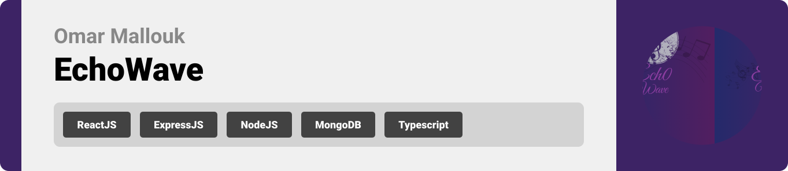
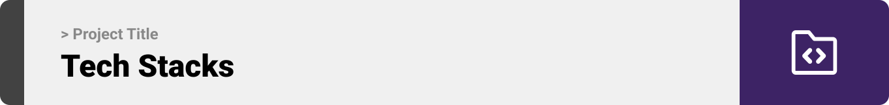
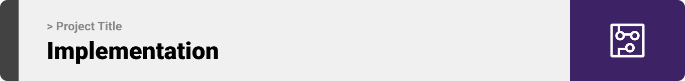
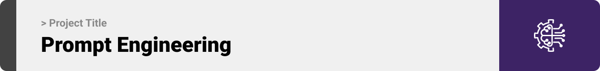

<br><br>

<!-- project philosophy -->


> EchoWave is a web app for songwriting assistant that helps users craft mood-based, genre-adaptive lyrics while ensuring originality and legal compliance.
>
> The aim to revolutionize the songwriting process by providing a creative, AI-driven platform for lyricists and musicians.

### User Stories
- As a user, I want to select a mood and genre, so I can generate lyrics that match the vibe of my song.
- As a user, I want to specify a rhyming scheme, so the lyrics fit the structure of my composition.
- As a user, I want to analyze the originality of my lyrics, so I can ensure they are unique and stand out.
- As a user, I want to receive legal compliance feedback, so I can avoid potential copyright issues.
- As a user, I want AI-suggested rewrites, so I can improve my lyrics while maintaining their essence.

<br><br>
<!-- Tech stack -->


###  Echo Wave is built using the following technologies:

- This project uses ReactJS for the frontend, providing a dynamic and interactive user interface.For backend services, we use Node.js and Express for a fast, scalable, and efficient server-side environment.
- The website's data is stored in MongoDB, a NoSQL database that allows for flexible storage and fast retrieval of user-generated content and AI-generated lyrics.
- For AI-powered features, we integrate TensorFlow.js and other NLP (Natural Language Processing) algorithms to analyze, score, and suggest original lyrics.
- The app uses the font ["Work Sans"](https://fonts.google.com/specimen/Work+Sans) as its main font, and the design of the app adheres to the material design guidelines.

<br><br>
<!-- UI UX -->


> We designed Echo Wave using wireframes and mockups, iterating on the design until we reached the ideal layout for easy navigation and a seamless user experience.

- Project Figma design [figma](https://www.figma.com/design/KTO5YNtWnqntKQt9lz1Und/Readme-Template-Assets?node-id=0-1&node-type=canvas&t=K3Fkt6JTuEkfsDfe-0)


### Mockups
| Home screen  | Menu Screen | Order Screen |
| ---| ---| ---|
|  |  |  |

<br><br>

<!-- Database Design -->


###  Architecting Data Excellence: Innovative Database Design Strategies:

- Insert ER Diagram here


<br><br>


<!-- Implementation -->



### User Screens (Mobile)
| Login screen  | Register screen | Landing screen | Loading screen |
| ---| ---| ---| ---|
|  |  |  |  |
| Home screen  | Menu Screen | Order Screen | Checkout Screen |
|  |  |  |  |

### Admin Screens (Web)
| Login screen  | Register screen |  Landing screen |
| ---| ---| ---|
|  |  |  |
| Home screen  | Menu Screen | Order Screen |
|  |  |  |

<br><br>


<!-- Prompt Engineering -->


###  Mastering AI Interaction: Unveiling the Power of Prompt Engineering:

- This project uses advanced prompt engineering techniques to optimize the interaction with natural language processing models. By skillfully crafting input instructions, we tailor the behavior of the models to achieve precise and efficient language understanding and generation for various tasks and preferences.

<br><br>

<!-- AWS Deployment -->


###  Efficient AI Deployment: Unleashing the Potential with AWS Integration:

- This project leverages AWS deployment strategies to seamlessly integrate and deploy natural language processing models. With a focus on scalability, reliability, and performance, we ensure that AI applications powered by these models deliver robust and responsive solutions for diverse use cases.

<br><br>

<!-- Unit Testing -->


###  Precision in Development: Harnessing the Power of Unit Testing:

- This project employs rigorous unit testing methodologies to ensure the reliability and accuracy of code components. By systematically evaluating individual units of the software, we guarantee a robust foundation, identifying and addressing potential issues early in the development process.

<br><br>


<!-- How to run -->


> To set up Coffee Express locally, follow these steps:

### Prerequisites

This is an example of how to list things you need to use the software and how to install them.
* npm
  ```sh
  npm install npm@latest -g
  ```

### Installation

_Below is an example of how you can instruct your audience on installing and setting up your app. This template doesn't rely on any external dependencies or services._

1. Get a free API Key at [example](https://example.com)
2. Clone the repo
   git clone [github](https://github.com/your_username_/Project-Name.git)
3. Install NPM packages
   ```sh
   npm install
   ```
4. Enter your API in `config.js`
   ```js
   const API_KEY = 'ENTER YOUR API';
   ```

Now, you should be able to run Coffee Express locally and explore its features.